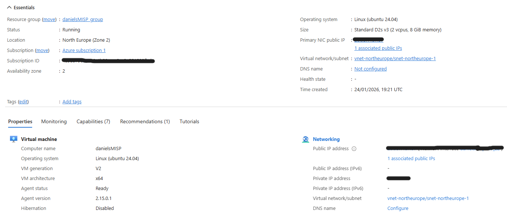

  

# Threat Intelligence Platform Deployment Integration - MISP & Docker

## Overview
Threat intelligence lab using MISP and Docker, exploring event ingestion, API access, and integration with a cloud SIEM to understand real-world TI workflows and challenges.

---

## Architecture

- MISP deployed using Docker and docker-compose
- Linux virtual machine hosting containerized services
- MISP API used to access and filter threat intelligence events
- Azure-based SIEM (Microsoft Sentinel) as a downstream consumer
- Secure secret handling using Azure Key Vault
- Serverless integration logic using Azure Functions

The project emphasizes end-to-end understanding rather than a single component.

---

## MISP Deployment (Docker)

MISP was deployed using the official **misp-docker** project.
Docker was chosen to simplify deployment, dependency management, and upgrades.

### Steps:
- Deployed MISP using `docker-compose`
- Verified all containers reached a healthy state
- Configured MISP base URL and API access
- Enabled and ingested multiple OSINT and curated feeds

---

## Virtual Machine & Networking
The MISP instance runs on an Azure Linux VM.
Network access was restricted using Network Security Groups (NSGs).

### Configuration Highlights:
- Explored MISP event, attribute, and tagging models
- Configured API queries with event filters (published status, timestamps, tags)
- Investigated how threat intelligence is normalized and exported
- Evaluated challenges of mapping open-source TI into SIEM-friendly formats

